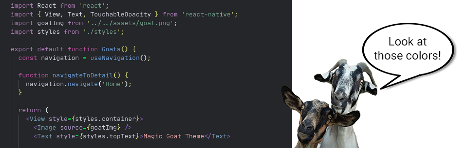
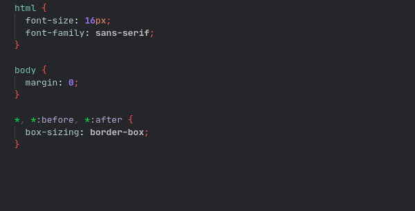
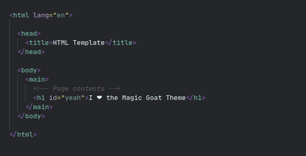
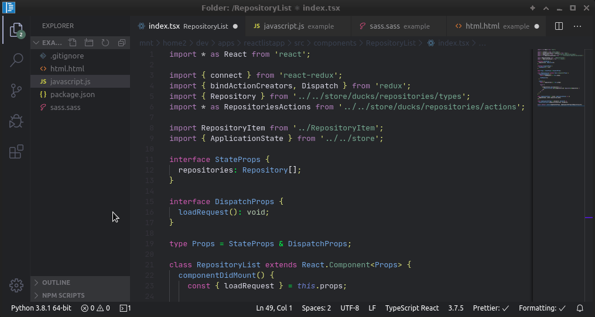

  

## 🟣 Magic Goat Theme

> A [VS Code](https://code.visualstudio.com/) theme for those who like codes and goats. 🐐

## 🟣 Links

- [Download - Visual Studio Code](https://code.visualstudio.com/)
- [Download - Magic Goat Theme](https://marketplace.visualstudio.com/items?itemName=BON4S.magic-goat-theme)

## 🟣 Screenshots

